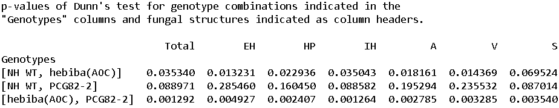

.. PyMS documentation master file, created by
   sphinx-quickstart on Sun Oct 14 12:34:33 2018.
   You can adapt this file completely to your liking, but it should at least
   contain the root `toctree` directive.

Welcome to PyMS's documentation!
=================================

Python for Mycorrhizal Symbiosis analysis (PyMS) is a graphical user interface-based programme to visualize quantitative analysis of mycorrhizal fungi colonization of plant roots and perform statistical analysis of the data. It was developed to help researchers who are not familiar with command line-based softwares, or who want to increase their productivity during data analysis.

Documentation
=============

Installation
------------

Please refer to the README file on the GibHub repository https://github.com/jschnab/pyms-plot.

Input data and file format
--------------------------

Quantification of arbuscular mycorrhizal fungus colonization of plant roots should be done via a modified version of the grid-line intersect method (see `Paszkowski, U., Jakovleva, L., and Boller, T. (2006). Maize mutants affected at distinct stages of the arbuscular mycorrhizal symbiosis. Plant J. 47 165–173 <https://www.ncbi.nlm.nih.gov/pubmed/16762030>`_) or an equivalent method.

The input file should be a csv file with a specific formatting (see *test_colonisation.csv* in the same repository for an example, data from `Chiu, C. H., Choi, J., Paszkowski, U. (2018) Independent signalling cues underpin arbuscular mycorrhizal symbiosis and large lateral root induction in rice. New Phytologist. 217 552-557 <https://www.ncbi.nlm.nih.gov/pubmed/29194644>`_).

Visualize the data and save a figure
------------------------------------

* Select the graphical parameters you want by ticking options in menus "Group by" and "Color".

* Click on the "Process" menu and click on "Analyze csv file", it will open a pop-up and you can browse your file.

* Click on the "File" menu and point on "Save as" to display the file type choice. Click on the file extension name to save your file in the same folder as your csv file. If you generate several figures by clicking on "Analyze csv file" several times, it will save the last figure generated.

Here is the expected output if you use the file *test_colonization.csv*.

.. image:: images/test_colonization.png 
  :width: 800
  :alt: plot

Statistical analysis
--------------------

PyMS allows you to perform statistical testing of inter-genotype comparisons using the Mann-Whitney test or the Kruskal-Wallis test followed by the Dunn test for post-hoc analysis (i.e. the Kruskal-Wallis test tells you if at least one genotype is different from the others while the Dunn test tells you which genotypes are different from the others). If you want to compare two genotypes, use the Mann-Whitney test. If you want to compare multiple genotypes, use the Kruskal-Walls then Dunn tests.

* If you have not opened the csv file in PyMS yet, click on the "Process" menu and click on "Analyze csv file", it will open a pop-up and you can browse your file.

* Click on the "Statistics" menu and select the test you want by ticking one of them. You then need to select the genotypes you want to analyze in the "Select samples" menu. You can detach the menu by clicking on the dashed line at the top of the window, so that you don't have to open the menu each time you select a genotype. Once you selected the genotypes of interest, click on "Perform statistical test" in the "Process" menu. The p-values returned by the test will be saved in a text file in the same folder as your csv file.

Here is an example if you perform the Mann-Whitney test on the genotypes *117KO* (loss-of-colonization mutant) and *117REV* (wild type) from the file *test_colonization.csv*. The column *Genotypes* indicates the genotypes which are compared. The other columns represent the different fungal structures. Yhe numbers in each column represent the p-value for the difference in colonization levels for the different fungal structures.

.. image:: images/mann_whitney.png 
  :width: 600
  :alt: mann-whitney

Here is another example if you perform the Kruskal-Wallis test followed by the Dunn test on the genotypes *hebiba (AOC)* (loss-of-function mutant), NH WT (wild type) and PCG82-2 (complemented loss-of-function mutant). The results are displayed as for the Mann-Whitney test except there are more genotypes comparisons.

Support
-------

If you have any question regarding PyMS, please send an email to jonathan.schnabel31@gmail.com.
